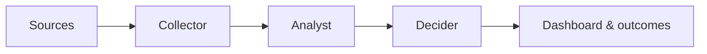

# Pulse — Feedback Collector & Prioritizer

> Turn customer noise into a product compass.

[](https://www.python.org/)
[](https://github.com/MadanMohan0537/feedback-prioritizer/actions/workflows/ci.yml)
[](https://streamlit.io/)
[](LICENSE)

Pulse is an open, local-first Voice of Customer platform. It collects feedback from disconnected channels, validates and protects it, discovers recurring customer problems, and produces a transparent “work on this first” list.

It closes the loop from **customer signal → normalized evidence → insight → priority → release outcome** without hiding decisions behind an unexplained AI score.

## Why Pulse exists

Support tickets, reviews, surveys, communities, and sales conversations each show only part of the customer experience. Copying them into a spreadsheet does not solve the problem: records get duplicated, identities leak, source context disappears, and the loudest anecdote still wins.

Pulse separates the problem into four layers:



| Layer | Responsibility | Current implementation |
|---|---|---|
| Collector | Fetch, validate, redact, deduplicate, checkpoint, store | SQLite, JSONL, CSV, synthetic, generic JSON, Typeform, Zendesk, Intercom, Apple, Google Play |
| Analyst | Split opinions, score sentiment, discover topics | RoBERTa/VADER and BERTopic/TF-IDF fallbacks |
| Decider | Rank issues using explainable business factors | Tunable five-factor score |
| Bridge | Explore evidence and measure shipped outcomes | Streamlit dashboard, governance registry, release tracking |

## Features

### Reliable collection

- Versioned canonical feedback contract
- Immutable raw-event capture for replay and debugging
- Transactional SQLite normalized store
- Source-specific incremental checkpoints
- Idempotent `(source, external_id)` upserts
- Cross-record content hashes
- Email, phone, and IP-address redaction enabled by default
- Deterministically pseudonymized user identifiers
- Dead-letter storage for invalid records
- JSONL export for downstream tools
- Synthetic feedback generator for safe demos
- CSV and JSONL bulk imports
- Generic JSON API, Typeform, Zendesk, Intercom, Apple App Store, and Google Play adapters
- Retry and exponential backoff for temporary API failures

### Feedback intelligence

- Aspect-level opinion splitting
- Transformer sentiment with a VADER fallback
- BERTopic clustering with a TF-IDF/KMeans fallback
- Feature-request detection
- Topic trend and affected-account analysis
- Persistent topic names, owners, workflow status, and merges
- Post-release sentiment comparison

### Transparent prioritization

```text
priority = 100 × (
    0.28 × frequency
  + 0.24 × negativity
  + 0.20 × business impact
  + 0.16 × emerging trend
  + 0.12 × customer value
)
```

Every factor is normalized and visible. Product managers can change weights in the dashboard and see the ranking update immediately. Feature requests are separated from complaints so neutral requests are not unfairly suppressed by sentiment.

## Quick start

Requirements: Python 3.9 or newer.

```bash
git clone https://github.com/MadanMohan0537/feedback-prioritizer.git
cd feedback-prioritizer
python -m venv .venv
source .venv/bin/activate          # Windows: .venv\Scripts\activate
pip install -r requirements.txt
```

Initialize the collector and generate 100 safe sample records:

```bash
python pulse.py init
python pulse.py fetch --source synthetic --count 100
python pulse.py stats
python pulse.py export --output exports/feedback.jsonl
```

Run the dashboard:

```bash
streamlit run app.py
```

Open **Use your own data** in the sidebar and choose **Load collected records** to analyze SQLite data. You can also upload a CSV or replay the bundled 650-row dataset.

## Collector commands

```bash
# Import CSV or JSONL
python pulse.py fetch --source file --path data/my_feedback.csv

# Pull a generic API whose records are in an `items` array
PULSE_API_TOKEN=... python pulse.py fetch \
  --source json --name community --url https://example.com/api/feedback

# Typeform responses
TYPEFORM_FORM_ID=... TYPEFORM_TOKEN=... \
  python pulse.py fetch --source typeform

# Zendesk incremental tickets
ZENDESK_SUBDOMAIN=... ZENDESK_TOKEN=... \
  python pulse.py fetch --source zendesk

# Intercom conversations
INTERCOM_TOKEN=... python pulse.py fetch --source intercom

# App-store reviews (short-lived vendor access tokens)
APPLE_APP_ID=... APPLE_CONNECT_TOKEN=... python pulse.py fetch --source apple
GOOGLE_PLAY_PACKAGE=... GOOGLE_PLAY_ACCESS_TOKEN=... \
  python pulse.py fetch --source google-play

# Filter an export to one source
python pulse.py export --source zendesk --output exports/zendesk.jsonl

# Honor a deletion request using the stored hashed identifier
python pulse.py delete-user HASHED_USER_ID
```

Use cron, a container scheduler, or a workflow runner to invoke `pulse.py fetch`. A checkpoint advances only after the batch has been processed.

## Canonical schema

Every connector returns a `FeedbackEntry`:

```json
{
  "id": "internal-uuid",
  "external_id": "ticket-123",
  "source": "zendesk",
  "source_type": "support_ticket",
  "timestamp": "2026-08-29T12:30:00Z",
  "ingested_at": "2026-08-29T12:31:12Z",
  "updated_at": "2026-08-29T12:30:45Z",
  "user_id": "pseudonymous-sha256",
  "text": "Export freezes on large files.",
  "language": "en",
  "rating": null,
  "url": "",
  "product": "analytics",
  "product_version": "3.4.1",
  "metadata": {"priority": "high"},
  "content_hash": "sha256",
  "schema_version": "1.0"
}
```

`external_id` makes retries safe. `content_hash` detects identical text across feeds. `timestamp` records when the customer spoke; `ingested_at` records when Pulse received it.

## Adding a connector

Implement the protocol from `src/collector/connectors/base.py`:

```python
class MyConnector:
    name = "my_source"

    def fetch(self, checkpoint=""):
        records = []
        # records.append((FeedbackEntry(...), original_payload))
        return FetchResult(records=records, next_cursor="vendor-cursor")
```

Pass it through `src.collector.pipeline.collect`. The pipeline handles redaction, user hashing, persistence, run metrics, dead letters, and checkpoint commits.

## Privacy and security

Customer feedback can contain personal or confidential data. Pulse therefore:

- Redacts common emails, phone numbers, and IP addresses before analysis.
- Hashes source user IDs using `PULSE_HASH_SALT`.
- Keeps tokens in environment variables rather than code or SQLite.
- Avoids logging raw feedback.
- Provides deletion by pseudonymous user ID.
- Keeps the local database and `.env` out of Git.

Redaction is a safety layer, not a legal guarantee. Pseudonymized records can remain personal data. Before using production data, define a lawful purpose, retention window, access policy, and deletion process appropriate to your organization and jurisdiction.

## Data-quality report

Every collection run prints machine-readable metrics:

```json
{
  "source": "synthetic",
  "fetched": 100,
  "accepted": 100,
  "duplicates": 0,
  "invalid": 0,
  "redacted": 0,
  "errors": 0
}
```

## Project structure

```text
feedback-prioritizer/
├── app.py                       # Streamlit command center
├── pulse.py                     # Collector CLI entry point
├── src/
│   ├── collector/
│   │   ├── cli.py               # init/fetch/stats/export/delete-user
│   │   ├── models.py            # canonical FeedbackEntry
│   │   ├── pipeline.py          # privacy → storage → checkpoint
│   │   ├── privacy.py           # PII guard and identifier hashing
│   │   ├── quality.py           # run-quality metrics
│   │   ├── storage.py           # SQLite/raw/dead-letter storage
│   │   └── connectors/          # files, synthetic, HTTP vendors
│   ├── sentiment.py             # sentiment and fallback
│   ├── topic_model.py           # topic discovery and fallback
│   ├── opinion_units.py         # multi-aspect splitting
│   ├── prioritize.py            # explainable ranking
│   ├── governance.py            # workflow state
│   └── outcomes.py              # post-release validation
├── data/sample_reviews.csv
├── scripts/evaluate.py
└── tests/
```

## Testing and evaluation

```bash
python -m unittest discover -s tests -p "test_*.py" -v
python tests/smoke_test.py
python scripts/evaluate.py
```

Collector tests cover idempotent reruns, upserts, raw persistence, imports, exports, PII handling, and deletion. Intelligence evaluation reports topic Adjusted Rand Index/NMI, sentiment-proxy accuracy, ranking bounds, ordering, and explanation coverage.

Synthetic evaluation is a regression signal—not a substitute for a labeled, anonymized sample from the intended organization.

## Honest limitations

- Typeform and Zendesk are initial REST adapters; full multi-tenant OAuth belongs in a service deployment.
- Lightweight PII detection cannot detect every sensitive phrase.
- Exact hashing detects identical text, not semantic similarity; embedding-based near-duplicate grouping is planned.
- Opinion splitting and feature-request detection include heuristic fallbacks.
- Topic granularity depends on dataset size and clustering parameters.
- Impact keywords and default weights should be calibrated using organization-specific outcomes.
- SQLite targets a single-node deployment. Multi-worker production deployments should use a managed database and job queue.

## Roadmap

- Typeform webhooks and complete multi-page vendor backfills
- Reddit/community connectors with policy-aware retention
- Connector health checks and dead-letter replay
- Semantic near-duplicate grouping with provenance
- Language detection and multilingual embeddings
- Jira/GitHub issue creation with human approval
- Slack and email reports
- Background topic-model jobs
- Learned impact weights from churn, refunds, and adoption
- Automatic post-release “resolved” detection

## Product principles

1. **Evidence stays traceable.** Every insight links back to normalized source records.
2. **Collection is retry-safe.** Re-running a source must not inflate demand.
3. **Scores are explainable.** Stakeholders can see and challenge every factor.
4. **Humans govern actions.** Models recommend; product teams decide.
5. **Privacy starts at ingestion.** Minimize sensitive data before NLP or export.
6. **The system degrades gracefully.** A local demo works without a GPU or hosted model.

## License

MIT — see [LICENSE](LICENSE).
